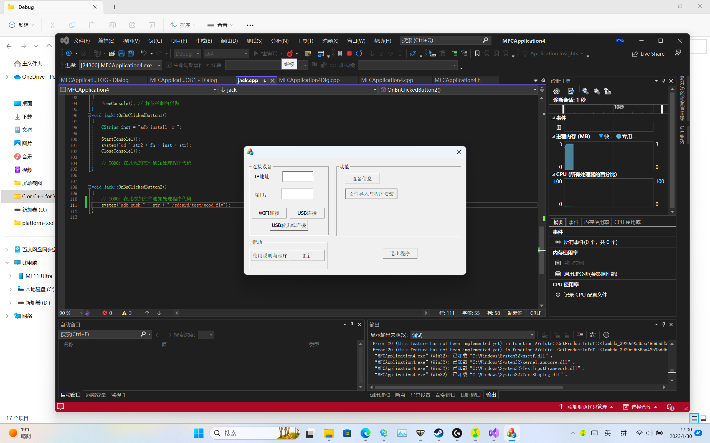

[简体中文](README.md) | [English](README_en.md)

    <h1>AndroidADBToolBox — Android ADB tools</h1>
    
    

	
This is an Android ADB tool software based on MFC

 

## 🚧Maintenance is currently paused

## Features
- ✅ ADB connection
- ✅ ADB upload

Android device PC console

The project is scheduled to launch on January 23, 2023.

The first beta version will be released on January 24, 2023.

The development of the toolbox is a complex and huge project. I have tried my best to visually add all functions into the program. You can now download the beta version to experience it.
# Supported devices
Android-based devices, including phones, tablets, watches, TVs, and development boards

Wear OS watches

Android TV OS televisions and vehicle head units

Windows 11 WSA virtual machines and Android emulators on Windows
# V1.5.0 application interface

